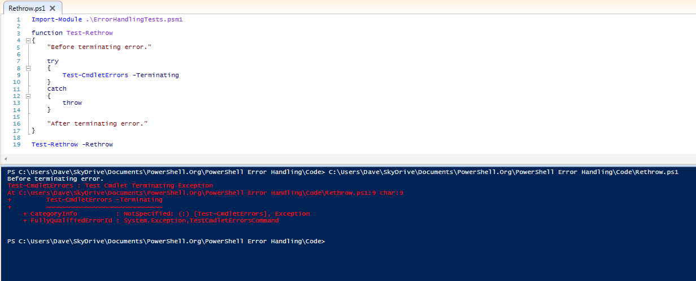
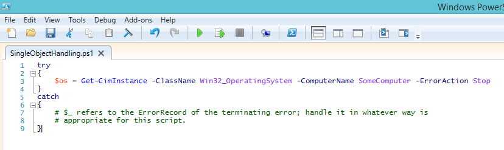

#  Análisis de los resultados de las pruebas de manejo de errores

Como se mencionó en la introducción, el código de prueba y sus archivos de salida están disponibles para su descarga. Vea la sección "acerca de", al comienzo de este libro, para conocer la ubicación. Son un montón de datos, no muy bien formateados en un documento de Word, por lo que no serán incluidos en el contenido de los archivos en este libro. Si te cuestionas acerca de  cualquiera de los análisis o conclusiones que he presentado en esta sección, te animo a descargar y revisar tanto el código como los archivos de resultados.

El código de prueba consta de dos archivos. El primero es un módulo de PowerShell (ErrorHandlingTestCommands.psm1) que contiene un Cmdlet, una clase .NET y varias funciones avanzadas para producir errores Terminating y Non-Terminating a demanda, o para probar el comportamiento de PowerShell cuando se producen tales errores. El segundo archivo es el script ErrorTests.ps1, que importa el módulo, llama a sus comandos con varios parámetros y produce la salida que fue redirigida (incluyendo la secuencia de errores) a los tres archivos de resultados: ErrorTests.v2.txt, ErrorTests.v3. Txt y ErrorTests.v4.txt.

Hay tres secciones principales en el script ErrorTests.ps1. La primera sección llama a los comandos para generar errores Terminating y Non-Terminating, y envía información sobre el contenido de $_ (en bloques Catch solamente), $Error y ErrorVariable. Estas pruebas tenían como objetivo responder a las siguientes preguntas:

- Cuando se trata sólo de errores Non-Terminating, ¿hay diferencias entre cómo $Error y ErrorVariable presentan la información acerca de los errores que ocurrieron? ¿Hay alguna diferencia si los errores provienen de un Cmdlet o función avanzada?

- Cuando se utiliza un bloque Try/Catch, ¿Hay diferencias en el comportamiento entre la forma en como $Error, ErrorVariable y $_ proporcionan información sobre el error Terminating que se produjo? ¿Hay alguna diferencia si los errores proceden de un Cmdlet, función avanzada o un método .NET?

- Cuando se producen errores Non-Terminating además del error, ¿Hay diferencias entre cómo $Error y ErrorVariable presentan la información? ¿Hay alguna diferencia cuando los errores provienen de un Cmdlet o función avanzada?

- En las pruebas anteriores, ¿Hay alguna diferencia entre un error Terminating que se produjo normalmente, en comparación con un error Non-Terminating que se produjo cuando ErrorAction o $ErrorActionPreference se establecieron a Stop?

La segunda sección consiste en algunas pruebas para determinar si ErrorAction o $ ErrorActionPreference afectan a los errores Terminating, o sólo a los errores Non-Terminating.

La sección final prueba cómo se comporta PowerShell cuando encuentra errores Terminating no controlados de cada origen posible (un Cmdlet que utiliza PSCmdlet.ThrowTerminatingError(), una función avanzada utiliza la sentencia Throw de PowerShell, un método .NET que genera una excepción, un Cmdlet o una Función avanzada que produce errores Non-Terminating cuando ErrorAction se establece en Stop en un comando desconocido).

Los resultados de todas las pruebas fueron idénticos en PowerShell 3.0 y 4.0. Powershell 2.0 tuvo un par de diferencias, que veremos en el análisis.

## Interceptando errores Non-Terminating

Comencemos hablando de errores Non-Terminating.

### ErrorVariable versus $Error

Cuando se trata de errores Non-Terminating, sólo hay una diferencia entre $Error y ErrorVariable: el orden de los errores en las listas se invierte. El error más reciente que se produce siempre se encuentra al principio de la variable $Error (índice cero) mientras que el error más reciente se encuentra al final de ErrorVariable.

## Interceptando errores Terminating

Esta es la verdadera “carne de la tarea”: Trabajar con errores Terminating, o excepciones.

### $\_

Al principio de un bloque Catch, la variable $\_ siempre se refiere a un objeto ErrorRecord para el error Terminating, independientemente de cómo se produjo ese error.

### $Error

Al principio de un bloque Catch, $Error[0] siempre se refiere a un objeto ErrorRecord para el error Terminating, independientemente de cómo se produjo ese error.

### ErrorVariable

Aquí, las cosas empiezan a complicarse. Cuando un error Terminating  se produce por un Cmdlet o una función y está utilizando ErrorVariable, la variable contendrá algunos elementos inesperados y los resultados son bastante diferentes en las distintas pruebas realizadas:

- Cuando se llama a una función avanzada que genera un error Terminating, ErrorVariable contiene dos objetos de ErrorRecord idénticos para el error. Además, si está ejecutando PowerShell 2.0, estos registros de errores son seguidos por dos objetos idénticos de tipo System.Management.Automation.RuntimeException. Estos objetos RuntimeException contienen una propiedad ErrorRecord, que hace referencia a los objetos ErrorRecord idénticos al par que también figuraba en la lista ErrorVariable. Los objetos adicionales RuntimeException no están presentes en PowerShell 3.0 o posterior.

- Cuando se llama a un Cmdlet que genera un error Terminating, ErrorVariable contiene un solo registro, pero no es un objeto ErrorRecord. En su lugar, es una instancia de System.Management.Automation.CmdletInvocationException. Como los objetos RuntimeException mencionados en el último punto, CmdletInvocationException tiene una propiedad ErrorRecord y esa propiedad se refiere al objeto ErrorRecord que se esperaba que estuviera contenido en la lista ErrorVariable.

- Cuando se llama a una función avanzada con ErrorAction establecido a Stop, ErrorVariable contiene un objeto del tipo System.Management.Automation.ActionPreferenceStopException, seguido por dos objetos de ErrorRecord idénticos. Como con los tipos RuntimeException y CmdletInvocationException, ActionPreferenceStopException todos contiene una propiedad ErrorRecord, que se refiere a un objeto ErrorRecord que es idéntico a los dos que se incluyeron directamente en la lista ErrorVariable. Además, si se ejecuta PowerShell 2.0, hay dos objetos más idénticos al tipo ActionPreferenceStopException, para un total de 5 entradas relacionadas con el mismo error de Terminating.

- Cuando se llama a un Cmdlet con ErrorAction establecido a Stop, ErrorVariable contiene un único objeto del tipo System.Management.Automation.ActionPreferenceStopException. La propiedad ErrorRecord de este objeto ActionPreferenceStopException contiene el objeto ErrorRecord que se esperaba que estuviera directamente en la lista ErrorVariable.

## Efectos de establecer ErrorAction o $ErrorActionPreference

Cuando se ejecuta un Cmdlet o una función avanzada y establece el parámetro ErrorAction, se afecta el comportamiento de todos los errores Non-Terminating. Sin embargo, también parece afectar a los errores Terminating producidos por la sentencia Throw en una función avanzada (aunque no afecta los procedentes de los Cmdlets a través del método PSCmdlet.ThrowTerminatingError())

Si establece la variable $ErrorActionPreference antes de llamar al comando, su valor afecta a los errores Terminating and Non-Terminating.

Esto es comportamiento no se encuentra documentado. Los archivos de ayuda de PowerShell indican que tanto la variable de preferencia como el parámetro sólo deberían afectar a los errores Non-Terminating.

## Cómo se comporta PowerShell cuando se encuentra errores Terminating  no controlados

Esta sección del código demostró ser un poco molesta de probar, porque el manejó de los errores en el alcance del padre (el script), afectó el comportamiento del código dentro de las funciones. Si el ámbito de la secuencia de comandos no tenía ningún tratamiento de errores, en muchos casos, el error no controlado abortó el script también. Como resultado, el script ErrorTests.ps1 y los archivos de texto que contienen su salida se escriben para mostrar sólo los casos en que se produce un error Terminating, pero la ejecución de la función continua y pasa al siguiente comando.

Si desea ejecutar la batería completa de pruebas para este comportamiento, importe el módulo ErrorHandlingTests.psm1 y ejecute manualmente los siguientes comandos en una consola de PowerShell. Como los va a ejecutar uno a la vez, no encontrará problemas con que algunos de los comandos fallen su ejecución debido a un error no controlado anterior. Caso distinto seria si estuvieran todos en un script.

```
Test-WithoutRethrow -Cmdlet -Terminating

Test-WithoutRethrow -Function -Terminating

Test-WithoutRethrow -Cmdlet -NonTerminating

Test-WithoutRethrow -Function -NonTerminating

Test-WithoutRethrow -Method

Test-WithoutRethrow -UnknownCommand
```

También hay una función Test-WithRethrow que se puede llamar con los mismos parámetros, para comprobar que los resultados son consistentes en los 6 casos cuando se maneja cada error y se elige si se aborta la función.

### PowerShell continúa la ejecución después de producirse un error Terminating, cuando:

- Un Cmdlet genera un error Terminating
- Un método .NET genera una excepción
- PowerShell encuentra un comando desconocido

### PowerShell detiene la ejecución después de producirse un error Terminating, cuando:

- Una función utiliza la sentencia Throw
- Cualquier error Non-Terminating en conjunto con ErrorAction establecido a Stop
- En cualquier momento cuando $ErrorActionPreference se establece a Stop en el ámbito del llamador

Con el fin de lograr un comportamiento coherente entre estas diferentes fuentes de errores Terminating, puede colocar los comandos que potencialmente podrían producir un error de terminación en un bloque try. En el bloque catch, puede decidir si aborta o no la ejecución del bloque de secuencia de comandos actual. La figura 3.1 muestra un ejemplo de cómo forzar una función a abortar cuando se genera una excepción de terminación desde un Cmdlet (una situación en la que PowerShell normalmente solo continuaría y ejecuta la sentencia "after terminating error"), volviendo a lanzar el error del bloque Catch. Cuando se usa Throw sin argumentos dentro de un bloque Catch, se pasa el mismo error hacia el ámbito padre.



Figura 3.1: Volviendo a lanzar un error Terminating  para forzar a una función a detener la ejecución.

## Conclusiones

Para errores Non-Terminating, puede utilizar $Error o ErrorVariable sin distinción. Solo debe tener presente en que el orden de los ErrorRecords se invierte, pero usted puede fácilmente controlar eso en su código, suponiendo que considere que eso sea un problema. Sin embargo, tan pronto como los errores Terminating entran en juego, ErrorVariable tiene un comportamiento muy molesto: a veces contiene objetos de excepción en lugar de ErrorRecords, y en otros casos, tiene uno o más objetos duplicados, todos relacionados con el error Terminating. Si bien es posible codificar alrededor de estas peculiaridades, realmente no parece que valga la pena el esfuerzo cuando se puede utilizar fácilmente $\_ o $Error[0].

Cuando está llamando a un comando que puede producir un error Terminating  y no maneja ese error dentro una sentencia Try/Catch o Trap, el comportamiento de PowerShell es inconsistente, dependiendo de cómo se generó el error Terminating. Para lograr resultados consistentes, independientemente de los comandos que esté llamando, coloque dichos comandos en un bloque Try y elija si desea volver a lanzar el error en el bloque Catch.




