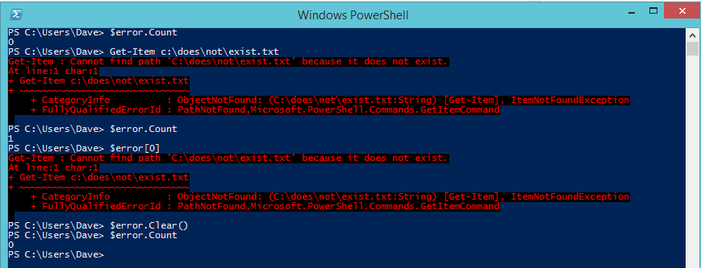
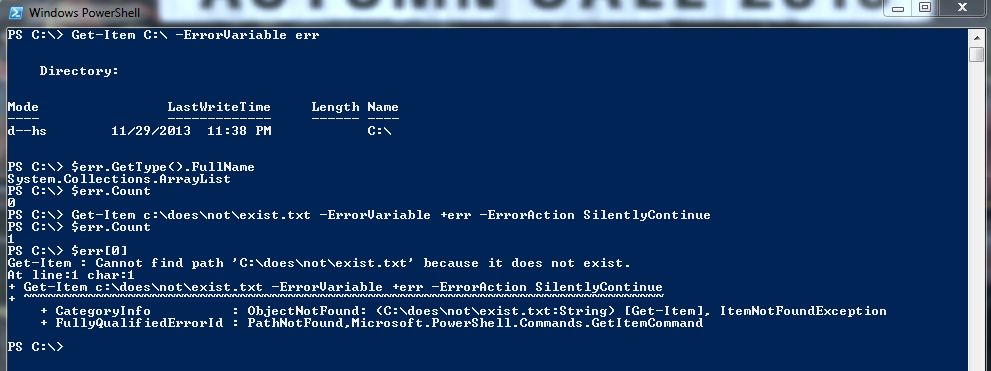
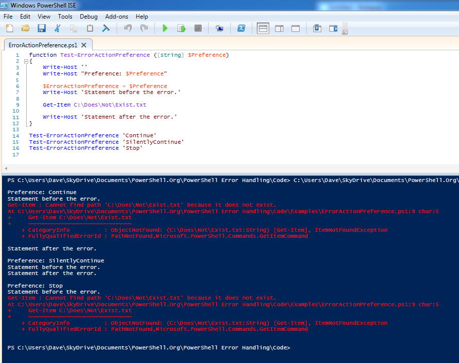
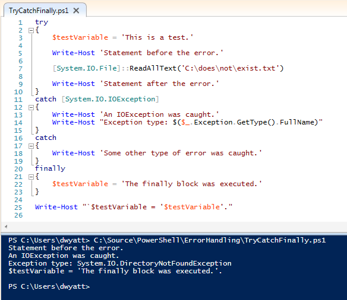
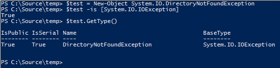
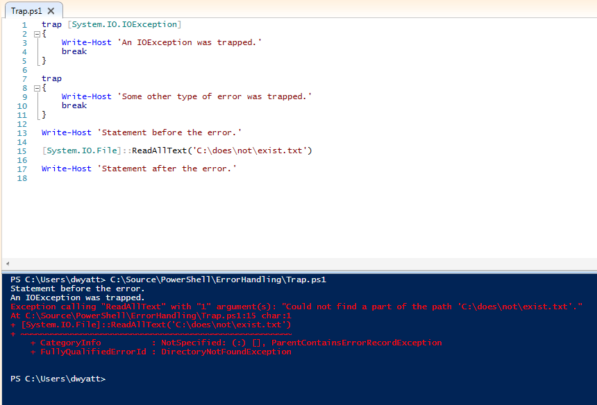
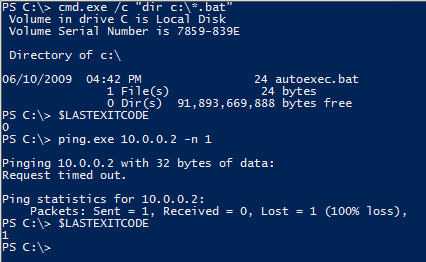
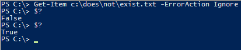

# Controlando el comportamiento de los errores

Esta sección muestra brevemente cómo usar cada una de las declaraciones, variables y parámetros de PowerShell que están relacionados con el reporte o manejo de errores.

## La variable $Error

$Error es una variable global automática en PowerShell que siempre contiene un ArrayList de cero o más objetos ErrorRecord. A medida que se producen nuevos errores, se agregan al principio de esta lista, por lo que siempre se puede obtener información sobre el error más reciente utilizando  $Error[0]. Los errores Terminating y Non-Terminating se incluirán en esta lista.

Aparte de acceder a los objetos de la lista con la sintaxis de matriz, hay otras dos tareas comunes que se realizan con la variable $Error: Se puede comprobar cuántos errores están actualmente en la lista utilizando la propiedad $Error.Count y puede eliminar todos los errores de la lista con el método $Error.Clear(). Por ejemplo:

Figura 2.1: Utilizando $Error para acceder a la información de error, verificar el recuento y borrar la lista.

Si está planeando hacer uso de la variable $Error en sus scripts, tenga en cuenta que puede contener información sobre errores que ocurrieron en la sesión actual de PowerShell, pero antes de que se iniciara la ejecución de su secuencia de comandos. Algunas personas consideran una mala práctica borrar la variable $Error dentro de un script. Como se trata de una variable global para la sesión de PowerShell, la persona que llamó a su secuencia de comandos podría revisar el contenido de $Error después de que su comando haya terminado la ejecución..

## ErrorVariable

El parámetro común ErrorVariable proporciona una alternativa al uso de la colección $Error anterior. A diferencia de $Error, ErrorVariable sólo contendrá los errores que se produjeron desde el comando que se está llamando, en lugar de tener potencialmente errores de otras partes en la sesión PowerShell. Esto también evita tener que borrar el contenido de $Error (con los problemas que esto podría ocasionar).

Cuando se utiliza ErrorVariable, si desea anexar a la variable de error en lugar de sobrescribirla, coloque un signo + delante del nombre de la variable. Tenga en cuenta que no se utiliza un signo de moneda cuando pasa un nombre de variable al parámetro ErrorVariable, pero si utiliza el signo de moneda más adelante cuando comprueba su valor.

La variable asignada al parámetro ErrorVariable nunca será nula. Si no se produjeron errores, contendrá un objeto ArrayList con un recuento de 0, como se ve en la figura 2.2:

Figura 2.2: Demostración del uso del parámetro ErrorVariable.

## $MaximumErrorCount

De forma predeterminada, la variable $Error sólo puede contener un máximo de 256 errores antes de que comience a desechar los elementos  más antiguos de la lista. Puede ajustar este comportamiento modificando la variable $MaximumErrorCount.

## ErrorAction y $ErrorActionPreference

Hay varias maneras en las que puede controlar el comportamiento de PowerShell. Las que probablemente utilizará con más frecuencia son los parámetro ErrorAction y la variable $ErrorActionPreference.

El parámetro ErrorAction se puede pasar a cualquier Cmdlet o función avanzada y puede tener uno de los siguientes valores: Continue (el valor por defecto), SilentlyContinue, Stop, Inquire, Ignore (sólo en PowerShell 3.0 o posterior), y Suspend (sólo para workflows, pero no se discutirá aquí). Este valor afecta el cómo se comporta el Cmdlet cuando produce un error Non-Terminating.

- El valor predeterminado Continue provoca que el error se escriba en la secuencia de errores y se agregue a la variable $Error. Entonces, el Cmdlet continuara su ejecución.

- El valor SilentlyContinue sólo agrega el error a la variable $Error. No escribe el error en la secuencia de errores (por lo que no se mostrará en la consola).

- El valor Ignore suprime el mensaje de error y no lo agrega a la variable $Error. Esta opción se agregó con PowerShell 3.0.

- El valor Stop  hace que los errores Non-Terminating se traten como errores Terminating, deteniendo inmediatamente la ejecución del Cmdlet. Esto también permite interceptar estos errores en una sentencia try / catch o trap, como se describe más adelante.

- El valor Inquire provoca que PowerShell pregunte al usuario si el script debe continuar o no cuando se produce un error.

La variable $ErrorActionPreference se puede utilizar igual que el parámetro ErrorAction, con un par de excepciones: no puede establecer $ErrorActionPreference en Ignore o Suspend. Además, $ErrorActionPreference afecta su alcance actual además de cualquier comando secundario que se llame. Esta sutil diferencia tiene el efecto de permitirle controlar el comportamiento de los errores producidos por los métodos .NET, u otras causas como cuando PowerShell se encuentra con un error del tipo "comando no encontrado".

La Figura 2.3 muestra los efectos de las tres configuraciones de ErrorActionPreference más utilizadas.

Figura 2.3: Comportamiento de $ErrorActionPreference

## Try/Catch/Finally

Las sentencias Try/ Catch/ Finally, agregadas en PowerShell 2.0, son la forma preferida de manejar los errores _Terminating_. No se pueden utilizar para manejar errores Non-Terminating, a menos que fuerce esos errores a convertirse en errores Terminating con ErrorAction o $ErrorActionPreference establecido en Stop.

Para usar Try/Catch/ Finally, comience con la palabra clave "Try" seguida de un solo bloque de secuencia de comandos de PowerShell. Después del bloque Try puede haber cualquier número de bloques Catch y cero o un bloque Finally. Debe haber un mínimo de un bloque Catch o un bloque Finally. Un bloque Try no puede ser utilizado por sí mismo, debe tener al menos un bloque Catch.

El código dentro del bloque Try se ejecuta hasta que se completa o se produce un error Terminating. Si se produce un error Terminating, se detiene la ejecución del código en el bloque Try. PowerShell escribe el error Terminating en la lista $Error y busca un bloque Catch coincidente (ya sea en el ámbito actual o en cualquier ámbito superior). Si no existe un bloque Catch para manejar el error, PowerShell escribe el error en la secuencia Error, lo mismo que habría hecho si el error hubiera ocurrido fuera de un bloque Try.

Los bloques Catch se pueden escribir para capturar sólo tipos específicos de excepciones, o para capturar todos los errores Terminating. Si define varios bloques de captura para diferentes tipos de excepciones, asegúrese de colocar los bloques más específicos en la parte superior de la lista. Las búsquedas de PowerShell analizan los bloques de arriba abajo, y se detienen tan pronto como encuentran la primera coincidencia.

Si se incluye un bloque Finally, ese código se ejecuta después de que los bloques Try y Catch estén completos (se hayan ejecutado), independientemente de si se ha producido o no un error. Esto está destinado principalmente a realizar una limpieza de los recursos (liberar memoria, llamar a métodos Close () o Dispose (), etc.)

La Figura 2.4 muestra el uso de un bloque Try/Catch/Finally:

Figura 2.4: Ejemplo del uso de Try/Catch/Finally.

Observe que el texto "Statement after the error" nunca se muestra, porque se produjo un error Terminating en la línea anterior. Dado que el error se produjo por una excepción IOException, se ejecutó ese bloque Catch, en lugar del bloque general "catch-all" que aparece al final. Después, el bloque Finally se ejecuta, cambiando el valor de $testVariable.

Fíjese también que mientras el bloque Catch especificaba un tipo [System.IO.IOException], el tipo de excepción real fue [System.IO.DirectoryNotFoundException]. Esto funciona porque DirectoryNotFoundException hereda de IOException, de la misma manera que todas las excepciones comparten el mismo tipo base [System.Exception]. Puede ver esto en la figura 2.5:

Figura 2.5: Mostrando que IOException es el tipo base para DirectoryNotFoundException.

## Trap

Las sentencias Trap fueron el método para manejar los errores Terminating en PowerShell 1.0. Al igual que con Try/Catch/Finally, la instrucción Trap no tiene ningún efecto en los errores Non-Terminating.

Trap es un poco incómodo de usar, ya que se aplica a todo el ámbito donde se define (y los ámbitos hijos también), en lugar de tener la lógica de manejo de errores cerca del código que podría producir el error como cuando se utiliza Try/Catch/Finally. Para aquellos de ustedes familiarizados con Visual Basic, Trap es parecido a "On Error Goto". Por eso, las sentencias Trap no ven mucho uso en los scripts de PowerShell modernos, y no los incluí en los scripts de prueba ni en el análisis de la Sección 3 de este libro.

En aras de mantener la integridad, he aquí un ejemplo de cómo usar Trap:

Figura 2.6: Uso de la sentencia Trap

Como puede ver, los bloques Trap se definen de la misma forma que los bloques Catch, especificando opcionalmente un tipo Exception. Los bloques Trap pueden terminar opcionalmente con una instrucción Break o Continue. Si no se utiliza ninguno de estos, el error se escribe en la secuencia Error (Error Stream) y el bloque de secuencia de comandos actual continúa con la siguiente línea después del error. Si utiliza Break, como se ve en la figura 2.5, el error se escribe en la secuencia Error (Error Stream)  y el resto del bloque de secuencia de comandos actual no se ejecuta. Si utiliza Continue, el error no se escribe en la secuencia de errores y el bloque de secuencia de comandos continúa la ejecución con la siguiente instrucción.

## La variable $LASTEXITCODE

Cuando llama a un programa ejecutable externo en lugar de un Cmdlet, un Script o una función de PowerShell, la variable $LASTEXITCODE contiene automáticamente el código de salida de dicho  proceso. La mayoría de los procesos utilizan por convención un código de salida con valor cero cuando el proceso finaliza con éxito y un valor diferente a cero si se produce un error, pero esto no está garantizado. Depende del desarrollador del ejecutable determinar qué significan sus códigos de salida.

Tenga en cuenta que la variable $LASTEXITCODE sólo se establece cuando llama a un ejecutable directamente o a través del operador de llamadas de PowerShell (&) o del Cmdlet Invoke-Expression. Si utiliza otro método, como Start-Process o WMI para iniciar el ejecutable, estos tienen sus propias maneras de comunicar su código de salida, por lo que no se afectará el valor actual de $LASTEXITCODE.

Figura 2.7: Uso de $ LASTEXITCODE

## La variable $? 

La variable $? es un valor booleano que se establece automáticamente después de cada instrucción PowerShell o tubería (pipeline) finaliza la ejecución. Estará establecida en True si el comando anterior se ha ejecutado correctamente o en False si se produjo un error. Si el comando anterior era una llamada a un exe nativo, $? se establecerá en True si la variable $ LASTEXITCODE es igual a cero, de lo contrario, False. Cuando el comando anterior era una sentencia de PowerShell, $? Se establecerá en False si se han producido errores (incluso si ErrorAction se estableció en SilentlyContinue o Ignore).

Sólo tenga en cuenta que el valor de esta variable se restablece después de cada instrucción. Debe comprobar su valor inmediatamente después del comando que le interesa o se sobrescribirá (probablemente en True). La Figura 2.8 muestra este comportamiento. La primera vez $? se establece en False, porque el Get-Item encontró un error. La segunda vez $? Se comprobó y se estableció en True, porque el comando anterior finalizo correctamente. En este caso, el comando anterior fue "$?" cuando se visualizó el valor de la variable.

Figura 2.8: Demostración del comportamiento de la variable $?

La variable $? no da ningún detalle sobre el error que ocurrió. Simplemente una bandera que indica que algo salió mal. En el caso de llamar a programas ejecutables, debe asegurarse de que devuelven un código de salida de 0 para indicar una operación exitosa y un valor distinto de cero para indicar un error antes de poder confiar en el contenido de $ ?.

## Resumen

Esto cubre todas las técnicas que puede utilizar para controlar, interceptar o manejar errores en un script de PowerShell. Resumiendo:

* Para interceptar y reaccionar ante errores Non-Terminating, comprueba el contenido de la colección automática $Error o de la variable que ha especificado como ErrorVariable. Esto se hace después de que el comando se completa. No puede reaccionar a un error Non-Terminating antes de que el Cmdlet o Función termine su trabajo.
* Para interceptar y reaccionar a la terminación de errores, utilice Try/Catch/Finally (preferido) o Trap (antiguo y en desuso). Ambos le permiten especificar diferentes bloques de secuencias de comandos para reaccionar a diferentes tipos de excepciones.
* Mediante el parámetro ErrorAction, puede cambiar la forma en que los Cmdlets y las funciones de PowerShell informan de errores Non-Terminating. Establecer a un valor de Stop hace que se conviertan en errores Terminating y entonces pueden interceptarse con Try/Catch/Finally o Trap.
* $ErrorActionPreference funciona como ErrorAction, excepto que también puede afectar al comportamiento de PowerShell cuando se produce un error Terminating, incluso si esos errores fueron ocasionados por el llamado a un método .NET en lugar de un Cmdlet.
* $LASTEXITCODE contiene el código de salida de ejecutables externos. Un código de salida cero normalmente indica una operación exitosa, pero eso depende del autor del programa.
* $? puede decirle si el comando anterior finalizo de forma exitosa, aunque debe tener cuidado al utilizarlo con comandos externos, si no siguen la convención de usar un código de salida con valor cero como indicador de éxito. También necesita asegurarse de comprobar el contenido de $? inmediatamente después del comando que le interesa.

