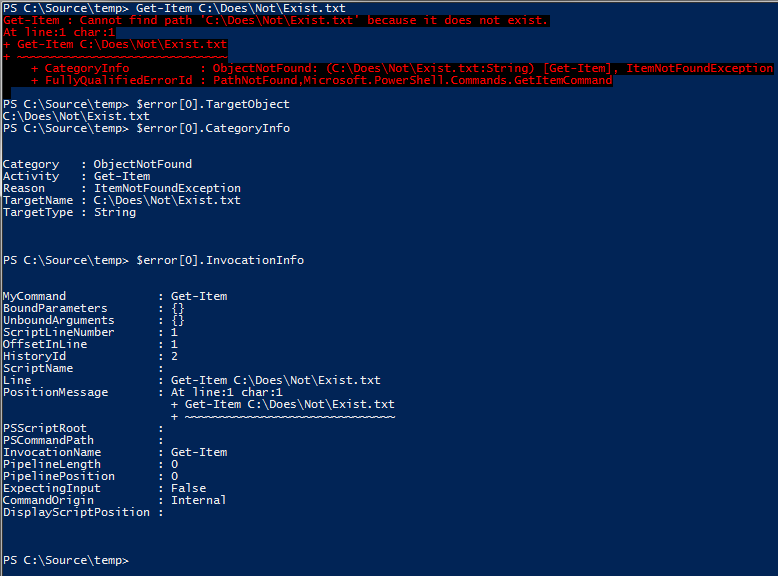

# Fundamentos para el manejo de errores en PowerShell

Empecemos por revisar  algunos de los conceptos básicos.

## ErrorRecords y Exceptions

En .NET Framework, sobre el que se construye PowerShell, el reporte de errores se realiza en gran medida lanzando excepciones. Las excepciones son objetos .NET que tienen como tipo base [System.Exception](http://msdn.microsoft.com/en-us/library/system.exception(v=vs.110).aspx). Estos objetos de excepción contienen suficiente información para comunicar todos los detalles del error a una aplicación de .NET Framework (el tipo de error que ocurrió, un seguimiento de pila de llamadas del método que condujo al error, etc.) que por sí solo no es suficiente información para proporcionar a un script de PowerShell. Por eso, PowerShell tiene su propio seguimiento de la pila de scripts y de llamadas de función de las que .NET Framework no sabe nada. También es importante saber qué objetos generaron errores, ya que una única sentencia o tubería (pipeline) es capaz de producir múltiples errores.

Por estas razones, PowerShell expone el objeto ErrorRecord. ErrorRecord contienen una excepción .NET, junto con varias otras piezas de información específica de PowerShell. Por ejemplo, la figura 1.1 muestra cómo acceder a las propiedades TargetObject, CategoryInfo e InvocationInfo de un objeto ErrorRecord; que proporcionan información útil para la lógica de manejo de errores de su script.



Figura 1.1: Algunas de las propiedades más útiles del objeto ErrorRecord.

## Terminating versus Non-Terminating Errors

PowerShell es un lenguaje extremadamente _expresivo_. Esto significa que una sola sentencia o pipeline de código PowerShell puede realizar el trabajo de cientos, o incluso miles de instrucciones crudas de CPU. Por ejemplo:

```
Get-Content .\computers.txt | Restart-Computer
```

Este pequeño script de PowerShell de tan solo 46 caracteres abre un archivo en disco, detecta automáticamente su codificación, lee el texto una línea a la vez, se conecta a cada computadora remota nombrada en el archivo, se autentica en ese equipo y, si tiene éxito, reinicia la computadora. Varios de estos pasos pueden encontrar errores, como en el caso del comando Restart-Computer, que puede tener éxito para algunos equipos y fallar para otros.

Por esta razón, PowerShell introduce el concepto de un error Non-Terminating. Un error Non-Terminating es aquel que no impide que el comando avance y pruebe el siguiente elemento en una lista de entradas. Por ejemplo, si uno de los equipos del archivo computers.txt está desconectado, eso no detendrá a PowerShell que seguirá intentando reiniciar el resto de los equipos del archivo.

Por el contrario, un error Terminating es uno que hace que el script o tubería (pipeline) falle. Por ejemplo, este comando busca las direcciones de correo electrónico asociadas con las cuentas de usuario en un Active Directory:

```
Get-Content .\users.txt |
Get-ADUser -Properties mail |
Select-Object -Property SamAccountName,mail
```

En este script, si el comando Get-ADUser no puede comunicarse con el Active Directory, no hay razón para seguir leyendo las líneas del archivo de texto o intentando procesar registros adicionales, por lo que se producirá un error Terminating. Cuando se encuentra este error Terminating, todo el script o tubería (pipeline) es abortado inmediatamente. Get-Content detendrá la lectura y cerrará el archivo.

Es importante conocer la distinción entre estos tipos de errores, ya que los scripts utilizarán diferentes técnicas para interceptarlos. Como regla general, la mayoría de los errores producidos por los Cmdlets no Non-Terminating (con algunas excepciones, aquí y allá).
