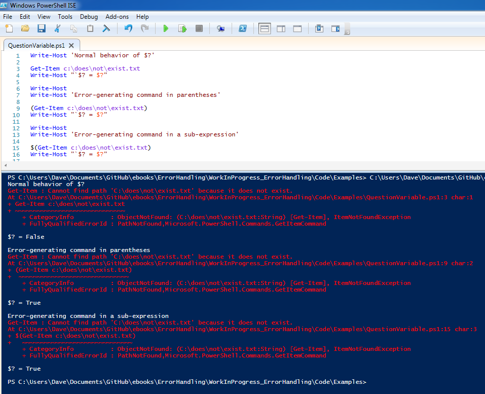
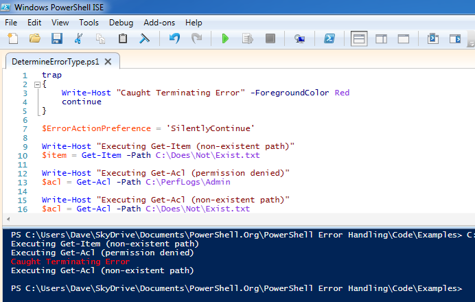
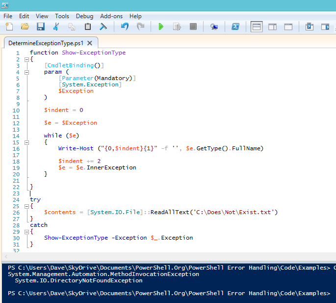
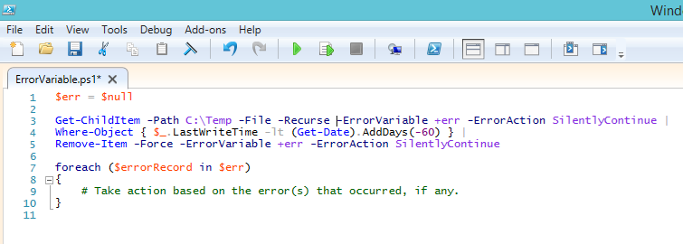
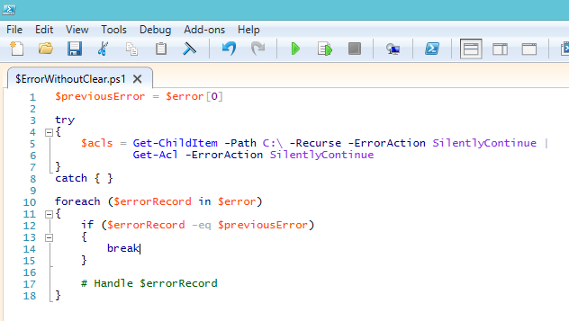

# Poniéndolo todo junto
Ahora que hemos examinado todas las herramientas de manejo de errores e identificado algunos posibles escenarios de "engañosos", he aquí algunos consejos y ejemplos de cómo abordar el manejo de errores en sus propios scripts.

## Supresión de errores (no haga esto)

Hay ocasiones en las que puede “procesar” un error sin la intención de manejarlo. En realidad, las situaciones válidas para estos escenarios son pocas. Procure no establecer ErrorAction o $ErrorActionPreference  en SilentlyContinue a menos que tenga la intención de examinar y verificar cada posible error, usted mismo más adelante en su código. Utilizar un bloque Try/Catch con un bloque Catch vacío equivale a la misma cosa. Por lo general esto no es lo correcto.

Es mejor al menos mostrar al usuario la salida de error por defecto en la consola, que tener un comando que falle sin indicación alguna de que algo salió mal.

## Uso de la variable $? (úselo bajo su propio riesgo)

La variable $? parece una buena idea al principio, pero hay muchas cosas que podrían salir mña como para simplemente confiar en esta variable en un script de producción. Por ejemplo, si el error es generado por un comando que está entre paréntesis o una sub-expresión, la variable $? se establecerá en true en lugar de false:

Figura 4.1: Falsos positivos con la variable $?

## Determinar qué tipos de errores puede producir un comando

Antes de que pueda decidir la mejor manera de manejar los errores de un comando en particular, a menudo necesitará saber qué tipo de errores puede producir. ¿Terminating o Non-Terminating? ¿Cuáles son los tipos de excepción que se pueden producir? Desafortunadamente, la documentación del Cmdlet de PowerShell no proporciona esta información, por lo que necesita recurrir a algún tipo de prueba y error. Aquí hay un ejemplo de cómo puede averiguar si los errores de un Cmdlet son Terminating or Non-Terminating:

Figura 4.2: Identificación de errores

Irónicamente, este era un lugar práctico tanto para usar la sentencia Trap como para establecer $ErrorActionPreference a SilentlyContinue, cosas que casi nunca haría en un script de producción. Como se puede ver en la figura 4.2, Get-Acl produce excepciones Terminating cuando el archivo existe, pero el Cmdlet no puede leer el ACL. Get-Item y Get-Acl producen errores Non-Terminating si el archivo no existe.

Pasar por este tipo de ensayo y error puede ser un proceso que consume mucho tiempo, sin embargo, es necesario que conozca las diferentes formas en que un comando puede fallar y, a continuación, reproducir esas condiciones para ver si el error resultante era Terminating o Non-Terminating. Como resultado de lo molesto que puede ser, además de este libro electrónico, el repositorio de Github contendrá una hoja de cálculo con una lista de errores Terminating conocidos de algunos Cmdlets. Será un documento “vivo”, posiblemente convertido en un wiki en algún momento, pero probablemente nunca será una referencia completa, debido a la gran cantidad de Cmdlets de PowerShell que existen por ahí, aunque esto es mucho mejor que nada.

Además de saber si los errores son Terminating o Non- Terminating, es posible que también desee conocer qué tipos de excepciones se producen. La figura 4.3 muestra cómo puede enumerar los tipos de excepción que están asociados con diferentes tipos de errores. Cada objeto de excepción puede contener opcionalmente una InnerException, y puede usar cualquiera de ellos en un bloque Catch o Trap:

Figura 4.3: Visualización de los tipos de Excepciones y de cualquier InnerException.

## Tratamiento de errores Terminating

Esta es la parte fácil. Sólo use try/catch, y consulte $\_ o $Error[0] en sus bloques Catch para obtener información sobre el error.

## Tratamiento de errores Non-Terminating

Tiendo a clasificar los comandos que pueden producir errores Non-Terminating (Cmdlets, funciones y secuencias de comandos) de una de tres maneras: comandos que necesitan procesar un solo objeto de entrada, comandos que sólo pueden producir errores Non-Terminating y comandos que podrían producir errores Terminating  o Non-Terminating. Suelo manejar cada una de estas categorías de las siguientes formas:

Si el comando sólo necesita procesar un único objeto de entrada, como en la figura 4.4, uso ErrorAction  en Stop y manejo los errores en un bloque Try /Catch. Debido a que el Cmdlet sólo trata con un único objeto de entrada, el concepto de un error Non-Terminating no es terriblemente útil de todos modos.

Figura 4.4: Utilizar Try/Catch y ErrorAction  en Stop cuando se trata de un solo objeto.

Si el comando sólo produce errores Non-Terminating, utilizó ErrorAction, pero esta categoría es más grande de lo que usted pensaría. La mayoría de los errores de un Cmdlet de PowerShell son Non-Terminating:

Figura 4.5: Uso de ErrorVariable en errores Terminating.

Cuando está examinando el contenido de ErrorVariable, recuerde que normalmente puede obtener información útil acerca de lo que falló al examinar la propiedad CategoryInfo.Activity del objeto ErrorRecord (cuyo Cmdlet produjo el error) y la propiedad TargetObject (cuyo objeto estaba procesando cuando el error ocurrió). Sin embargo, no todos los Cmdlets rellenan el ErrorRecord con un TargetObject, por lo que querrá realizar algunas comprobaciones para determinar cuán útil será esta técnica. Si encuentra una situación en la que un Cmdlet debe estar informándole sobre el TargetObject pero no lo hace, considere cambiar su estructura de código para procesar un objeto a la vez, como se muestra en la figura 4.4. De esa manera, ya sabrá qué objeto se está procesando.

Surge un escenario más complicado si un comando en particular puede producir errores Terminating y Non- Terminating. En esas situaciones, si es práctico, intentó cambiar mi código para llamar al comando en un objeto a la vez. Si se encuentra en una situación en la que esto no es deseable (aunque me parece difícil de encontrar un ejemplo), recomiendo el siguiente enfoque para evitar el comportamiento peculiar de ErrorVariable y evitar llamar a $Error.Clear():

Figura 4.6: usando $Error sin llamar a Clear() e ignorando los registros de errores previamente existentes.

Como se puede ver, la estructura de este código es casi igual que cuando se utiliza el parámetro ErrorVariable, con la adición de un bloque Try alrededor del código “problemático” y el uso de la variable $ previousError para asegurarnos de que sólo estamos reaccionando a nuevos errores en la colección $Error. En este caso, tengo un bloque Catch vacío, porque el error Terminating (si se produce) va a ser añadido también a $Error y manejado en el bucle foreach de todos modos. Es posible que prefiera manejar el error Terminating en el bloque Catch y los errores Non- Terminating en el bucle. De cualquier manera funciona.

## Llamando a programas externos

Cuando necesite llamar a un ejecutable externo, la mayor parte del tiempo obtendrá los mejores resultados comprobando $LASTEXITCODE, sin embargo, tendrá que asegurarse que el programa externo devuelve información útil a través de su código de salida. Hay algunos ejecutables “raros” por ahí que siempre devuelven 0, independientemente de si se encontraron o no errores.

Si un ejecutable externo escribe algo en el flujo StdErr, PowerShell a veces se percata de esto y envuelve el texto en un ErrorRecord, pero este comportamiento no parece ser consistente. No estoy seguro aún en qué condiciones se producirán estos errores, por lo que tiendo a utilizar $LASTEXITCODE cuando necesito establecer si un comando externo funcionó o no.

